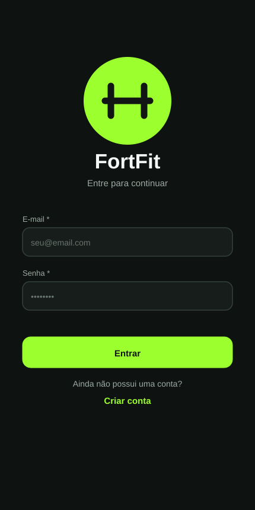
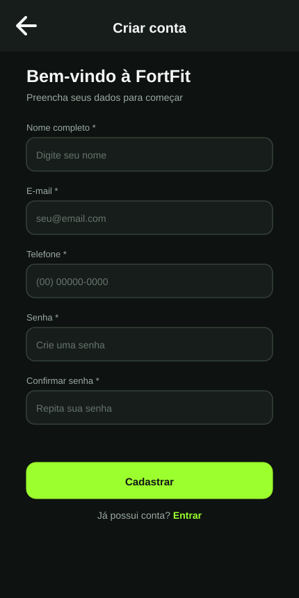
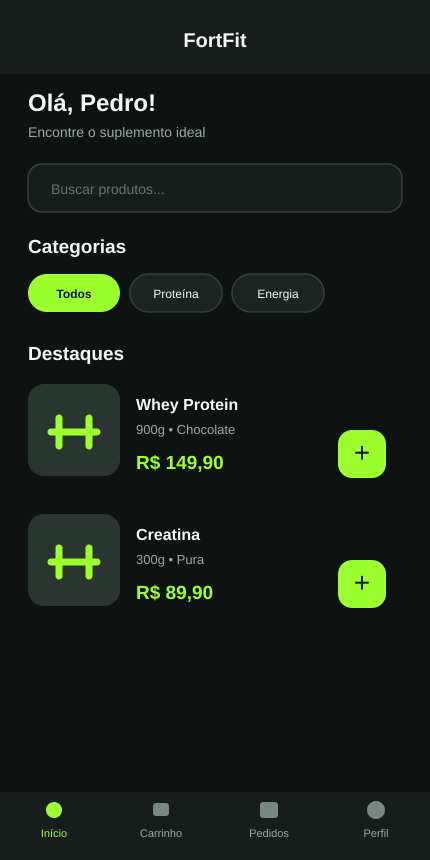
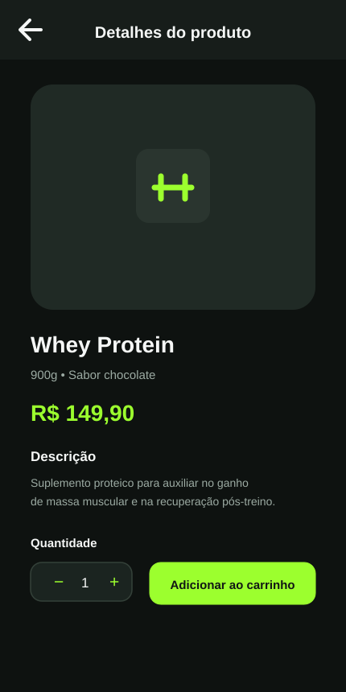
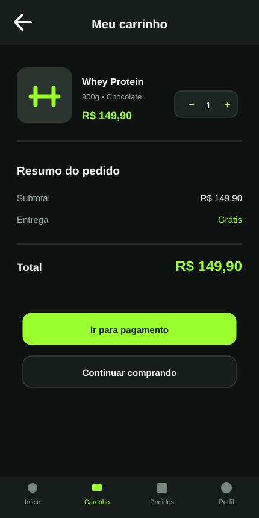
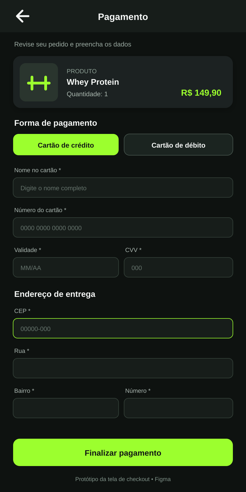
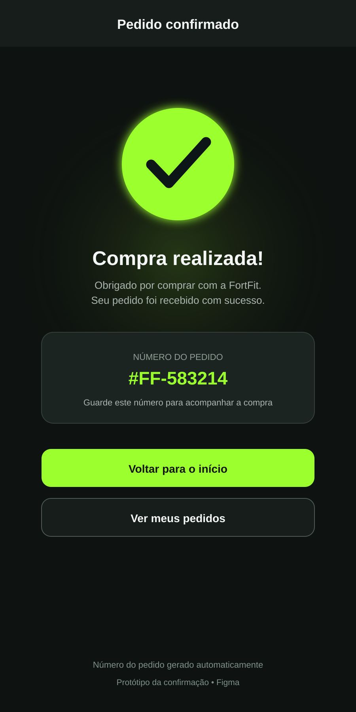
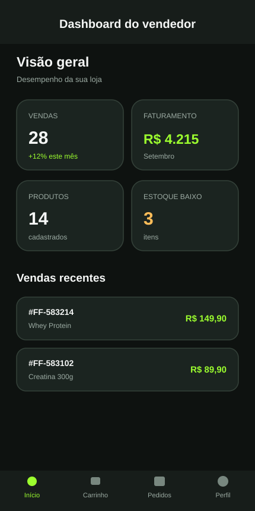
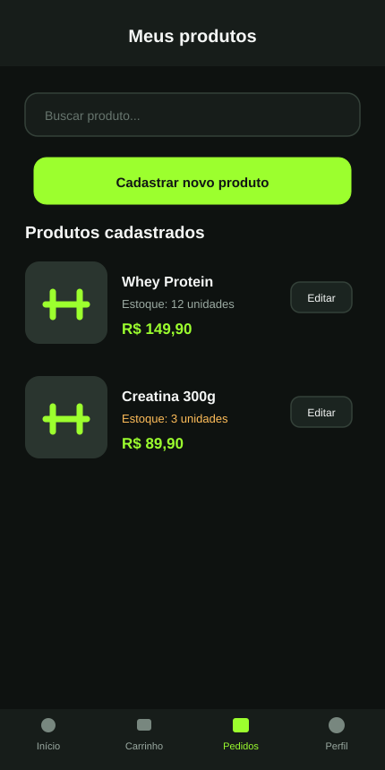
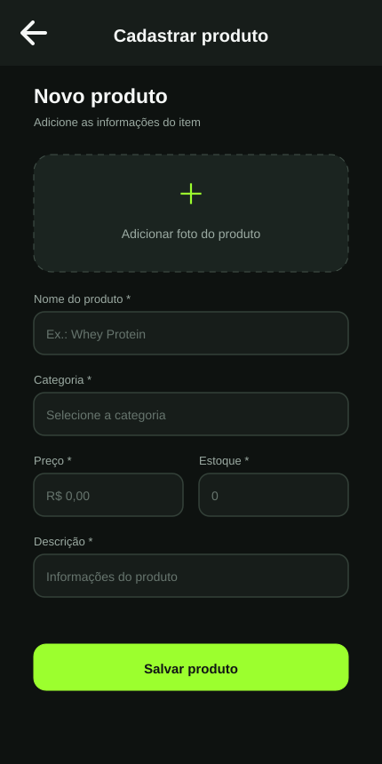

  

<h1 align="center">FortFit Mobile</h1>

  Aplicativo móvel de e-commerce fitness desenvolvido em React Native e Expo.

  
  
  

## Sobre o projeto

O **FortFit Mobile** é um projeto acadêmico de e-commerce voltado a pequenos empreendedores que estão começando no mercado de suplementos e produtos fitness. A proposta é oferecer uma experiência simples para cadastrar produtos, acompanhar a loja e permitir que clientes encontrem os itens e montem seus pedidos pelo celular.

> Este é um projeto desenvolvido em equipe. Este repositório pessoal registra minha participação e será atualizado com a versão consolidada do aplicativo ao final do semestre.

## Minha contribuição

Fiquei responsável pelo fluxo visual de **checkout e pagamento**, incluindo:

- resumo do produto com nome, foto, quantidade e valor;
- escolha entre cartão de crédito e débito;
- campos de dados do cartão;
- endereço exibido a partir do preenchimento do CEP;
- validação dos campos obrigatórios;
- complemento como campo opcional;
- tela de compra confirmada;
- geração visual de um número de pedido;
- prototipação das telas no Figma.

Nesta etapa, o pagamento é uma simulação acadêmica: o fluxo visual funciona, mas não realiza uma cobrança real.

## Protótipo completo

As telas seguem a identidade visual do FortFit: fundo grafite, cartões escuros, textos claros e verde-limão como cor de destaque.

  <a href="https://www.figma.com/design/t98GvpdNNbr07oQsvCyvlI">
    <strong>Abrir o protótipo completo no Figma</strong>
  </a>

### Fluxo do cliente

<table>
  <tr>
    <td align="center"></td>
    <td align="center"></td>
  </tr>
  <tr>
    <td align="center"><strong>Login</strong></td>
    <td align="center"><strong>Cadastro do usuário</strong></td>
  </tr>
  <tr>
    <td align="center"></td>
    <td align="center"></td>
  </tr>
  <tr>
    <td align="center"><strong>Catálogo</strong></td>
    <td align="center"><strong>Detalhes do produto</strong></td>
  </tr>
  <tr>
    <td align="center"></td>
    <td align="center"></td>
  </tr>
  <tr>
    <td align="center"><strong>Carrinho</strong></td>
    <td align="center"><strong>Pagamento</strong></td>
  </tr>
  <tr>
    <td align="center" colspan="2"></td>
  </tr>
  <tr>
    <td align="center" colspan="2"><strong>Compra confirmada</strong></td>
  </tr>
</table>

### Área do vendedor

<table>
  <tr>
    <td align="center"></td>
    <td align="center"></td>
  </tr>
  <tr>
    <td align="center"><strong>Dashboard do vendedor</strong></td>
    <td align="center"><strong>Gerenciamento de produtos</strong></td>
  </tr>
  <tr>
    <td align="center" colspan="2"></td>
  </tr>
  <tr>
    <td align="center" colspan="2"><strong>Cadastro de produto</strong></td>
  </tr>
</table>

## Funcionalidades planejadas

- cadastro e login de usuários;
- catálogo de suplementos e itens fitness;
- visualização dos detalhes dos produtos;
- carrinho de compras;
- checkout e confirmação do pedido;
- cadastro e gerenciamento de produtos;
- dashboard do vendedor com vendas, faturamento e estoque.

## Tecnologias

- React Native
- Expo
- JavaScript
- React Navigation
- Figma
- Git e GitHub

## Situação atual

O projeto está em desenvolvimento durante o semestre. Por enquanto, este repositório reúne a apresentação do trabalho, o protótipo e o registro da minha contribuição. O código completo será adicionado depois da integração das partes desenvolvidas pela equipe.

## Projeto da equipe

O desenvolvimento em grupo está sendo organizado no repositório:

[FortFit-MobileProject/FortFit](https://github.com/FortFit-MobileProject/FortFit)

## Autor

**Pedro Henrique G. Bertanhi**

[github.com/pedrobertanhi](https://github.com/pedrobertanhi)
